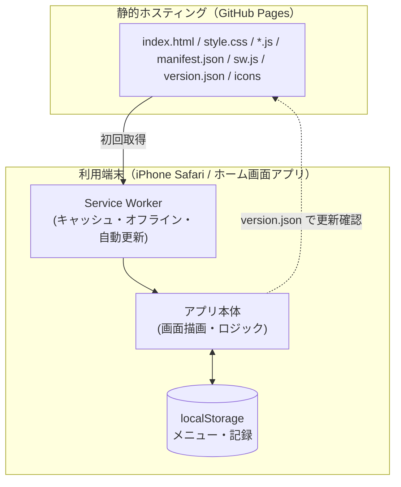
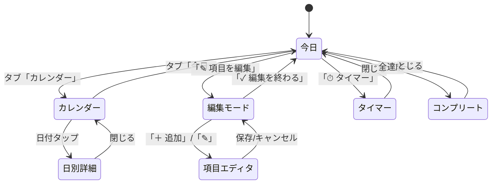

# 基本設計書 ― つづけるリハ

| 項目 | 内容 |
|---|---|
| 版 | 1.0（アプリ版数 v13） |
| 作成日 | 2026-06-20 |
| 位置づけ | 要件定義書を受け、システム全体の構成・画面・データ・主要処理の方針を定める。 |

---

## 1. システム構成

クライアント完結型のPWA。サーバ側の処理は持たず、静的ファイルを配信するだけ。データは端末内 localStorage に保存する。

## 2. 採用技術

| 区分 | 技術 |
|---|---|
| 画面 | HTML5 / CSS3（システムフォント、外部ライブラリ・フォントなし） |
| ロジック | Vanilla JavaScript（ES5相当の記法、ビルドなし） |
| オフライン／更新 | Service Worker（Cache Storage、fetchハンドラ） |
| 配置形態 | PWA（Web App Manifest、ホーム画面追加） |
| データ保存 | Web Storage API（localStorage / sessionStorage） |
| ホスティング | 静的ホスティング（GitHub Pages） |

## 3. 画面構成・画面遷移

### 3.1 画面（ビュー）一覧

| 画面 | 概要 |
|---|---|
| 今日（today） | 当日のメニューをセクションごとに表示し、タップで記録。上部に達成リング・連続日数。 |
| カレンダー（hist） | 月表示で日別達成度を色分け。月の集計を表示。 |
| 編集モード | 「今日」上で項目／セクションの追加・編集・削除・並べ替え。 |
| タイマー（overlay） | 単発／セットごとのカウントダウン。 |
| 日別詳細（overlay） | カレンダーの日付タップで、その日の内訳を表示。 |
| 項目エディタ（modal） | 項目の追加・編集フォーム。 |
| コンプリート（overlay） | 全達成時の祝福演出。 |

### 3.2 画面遷移

## 4. データ設計方針

- 保存先は localStorage。**「メニュー（設定）」**と**「記録（日次）」**を別キーで持つ。
- 各日付の記録には、その日の**メニュー構成のスナップショット**を併せて保存する。
- 達成率・色分け・継続日数は、各日付**自身のスナップショット**で計算する。
- これにより、メニューの変更は**当日以降のみ反映**され、前日までの履歴は当時の構成のまま固定される（要件 FR-11）。
- 「今日」のレコードは、アプリ起動時・編集時に**現在のメニューへ同期**（チェック状態は保持）する。過去日のレコードは書き換えない。
- 旧バージョンの保存形式は、起動時に新形式へ自動移行する。

> 論理データ構造の詳細は「ER図」「詳細設計書」を参照。

## 5. 主要処理方針

| 処理 | 方針 |
|---|---|
| 起動初期化 | メニュー読込→日次データ読込→旧形式移行→当日同期→初回描画。 |
| 記録 | 枠／セットのタップで状態をトグルし、即 localStorage 保存・進捗再計算。 |
| 集計 | 当日／各日の「達成ユニット数 ÷ 合計ユニット数」。全達成でコンプリート判定。 |
| タイマー | 項目設定から「フェーズ列」を生成し、1秒ごとに進行。境界でバイブ通知。 |
| 並べ替え | Pointer Events によるドラッグ。対象行を浮かせ、他行を CSS transform でずらす（再描画に頼らない）。確定時のみデータ反映。 |
| オフライン | Service Worker がネット優先・失敗時キャッシュ応答。 |
| 自動更新 | 起動時・前面復帰時に `version.json` をキャッシュ無視で取得し、版数差分があれば再読込で最新化。 |

## 6. ファイル構成（フラット）

| ファイル | 役割 |
|---|---|
| index.html | 画面構造（マークアップのみ） |
| style.css | スタイル |
| helpers.js | 共通ヘルパー（日付・ID・エスケープ・表示整形） |
| menu.js | メニュー定義（ビルダー・初期/旧メニュー）＋保存読込 |
| data.js | 移行・当日同期・集計 |
| today.js | 今日ビュー（描画・記録・進捗・演出） |
| calendar.js | タブ・カレンダー・日別詳細 |
| timer.js | タイマー |
| editor.js | 編集モード＋ドラッグ並べ替え |
| modal.js | 項目エディタ（頻度＋独立タイマー） |
| system.js | バックアップ／復元・バージョン／自動更新 |
| main.js | 初期化（最後に読み込み） |
| manifest.json / sw.js / version.json | PWA構成・オフライン・更新判定 |
| icon-*.png / favicon-64.png | アイコン |

JSは `index.html` 末尾で上記の順に読み込み、グローバルスコープを共有する（最後に `main.js` が初期化を実行）。

## 7. 例外・エラー処理方針

| 事象 | 方針 |
|---|---|
| localStorage 読み書き失敗 | try/catch で握りつぶし、既定値で継続（アプリは停止させない）。 |
| 不正なバックアップファイル | 解析失敗時はメッセージ表示し復元を中止。 |
| オフライン時の更新確認失敗 | 無視して通常起動（キャッシュで動作）。 |
| 画像／絵文字未対応 | 絵文字は端末描画に委ねる。アイコン未指定時は代替記号を表示。 |
