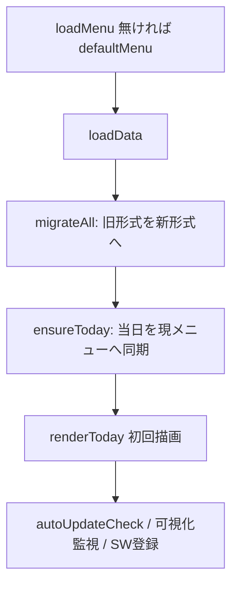
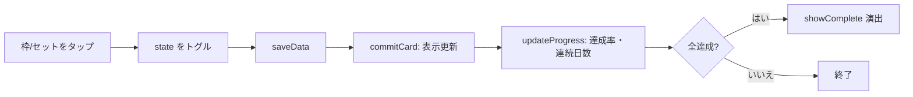
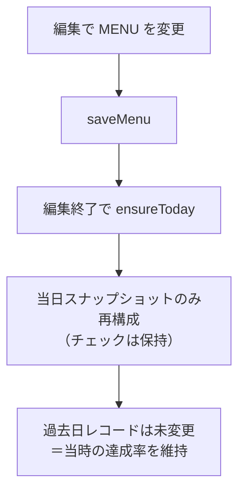
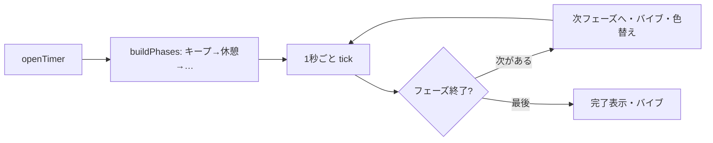

# 詳細設計書 ― つづけるリハ

| 項目 | 内容 |
|---|---|
| 版 | 1.0（アプリ版数 v13） |
| 作成日 | 2026-06-20 |
| 位置づけ | 基本設計を受け、モジュール・データ構造・主要関数・処理フローを具体化する。 |

---

## 1. モジュール構成（責務）

| ファイル | 責務 | 主な関数 |
|---|---|---|
| helpers.js | 共通ユーティリティ | `pad2` `keyOf` `todayKey` `uid` `esc` `units` `fmtDur` `freqText` `hasTimer` |
| menu.js | メニュー生成・保存 | `mkSlots` `mkSets` `mkTimer` `legacyMenu` `defaultMenu` `loadMenu` `saveMenu` `loadData` `saveData` |
| data.js | 移行・同期・集計 | `isNewRec` `migrateRec` `migrateAll` `snapMenu` `ensureToday` `totalUnits` `doneUnits` `itemDone` `recComplete` |
| today.js | 今日ビュー | `renderToday` `cardHTML` `bindToday` `commitCard` `updateProgress` `updateStreak` `resetToday` `showComplete` `hideComplete` |
| calendar.js | タブ・履歴 | `switchView` `renderCalendar` `moveMonth` `openDay` `closeDay` |
| timer.js | タイマー | `buildPhases` `openTimer` `paintTimer` `tick` `toggleTimer` `closeTimer` |
| editor.js | 編集・並べ替え | `toggleEdit` `renderEdit` `erowHTML` `bindEdit` `delSection` `moveSection` `dragStart` `dragMove` `dragEnd` |
| modal.js | 項目エディタ | `openModal` `updateModalFields` `closeModal` `saveModal` |
| system.js | 保存運用・更新 | `exportData` `importData` `checkUpdate` `autoUpdateCheck` |
| main.js | 初期化 | `setDateLine` `dismissHint`（＋起動処理） |

## 2. 主要データ構造

### 2.1 メニュー項目（item）

| プロパティ | 型 | 説明 |
|---|---|---|
| id | string | 一意キー |
| title | string | 表示名 |
| icon | string | 絵文字（任意） |
| sectionId | string | 所属セクションID |
| kind | 'slots' \| 'sets' | 枠型かセット型か |
| labels | string[] | slots時の枠ラベル（例：["朝","昼","夜"]） |
| sets | number | sets時のセット数 |
| count | number | sets時の1セットの量 |
| unit | '回' \| '秒' | sets時の単位 |
| note | string | 補足メモ（任意） |
| timerKind | 'none' \| 'single' \| 'interval' | タイマー種別 |
| timerSec | number | 単発の秒数／インターバルの1セット秒数 |
| restSec | number | インターバルのセット間休憩秒 |

### 2.2 メニュー（MENU）／日次記録（DATA）

```text
MENU = { sections:[ {id, title} ], items:[ item ] }          // localStorage: rehab-menu-v2

DATA = {
  "YYYY-MM-DD": {
    menu:  { sections:[...], items:[ item ] },  // その日のスナップショット
    state: { [itemId]: boolean[] }              // 枠/セットごとの達成
  }, ...
}                                                              // localStorage: rehab-data-v1
```

### 2.3 タイマーのフェーズ（buildPhases の戻り）

```text
phase = { label: string, sec: number, kind: 'keep' | 'rest' }
```

## 3. 主要関数仕様（抜粋）

| 関数 | 引数 | 戻り | 概要 |
|---|---|---|---|
| `units(mi)` | item | number | 1項目のユニット数（slots=ラベル数／sets=セット数）。 |
| `freqText(mi)` | item | string | 頻度の表示文字列（例「朝・昼・夜・1分間」）。 |
| `migrateRec(old)` | 旧形式の日次 | 新形式 | 旧フラット形式を menu/state 形式へ変換（旧名称で表示維持）。 |
| `ensureToday()` | ― | ― | 当日レコードを現メニューへ同期。既存チェックは保持、過去日は不変。 |
| `totalUnits(rec)` / `doneUnits(rec)` | 日次レコード | number | そのレコードの合計／達成ユニット数。 |
| `recComplete(rec)` | 日次レコード | boolean | 全ユニット達成か。 |
| `renderToday()` | ― | ― | 当日ビューを描画（空ならガイド表示）。 |
| `commitCard(id)` | itemId | ― | タップ後にカード表示と進捗を更新。 |
| `updateProgress()` | ― | ― | リング・達成数・連続日数・コンプリート判定。 |
| `renderCalendar()` | ― | ― | 月カレンダーを色分け描画＋月集計。 |
| `openDay(key)` | 日付 | ― | 日別詳細を表示。 |
| `buildPhases(mi)` | item | phase[] | 単発／インターバルのフェーズ列を生成。 |
| `tick()` | ― | ― | 1秒進行。フェーズ境界でバイブ・色替え。 |
| `dragStart/Move/End` | ― | ― | セクション内のスムーズ並べ替え。確定時のみ `MENU` 更新。 |
| `saveModal()` | ― | ― | フォーム入力から item を生成し `MENU` に反映。 |
| `exportData()` / `importData(e)` | ― / event | ― | メニュー＋記録のJSON書き出し／読み込み。 |
| `autoUpdateCheck()` | ― | ― | `version.json` を確認し版差分で再読込。 |

## 4. 主要処理フロー

### 4.1 起動初期化（main.js）



### 4.2 記録〜集計



### 4.3 メニュー編集と履歴固定（要：過去日不変）



### 4.4 タイマー（インターバル）



## 5. localStorage / sessionStorage キー

| キー | 保存先 | 内容 |
|---|---|---|
| `rehab-menu-v2` | localStorage | 現在のメニュー（MENU） |
| `rehab-data-v1` | localStorage | 日次記録（DATA） |
| `hideHint` | localStorage | インストール案内を閉じたか |
| `updTries` | sessionStorage | 自動更新の再読込ループ防止カウンタ |

## 6. バックアップ形式（JSON）

```json
{ "__rehab": 1, "version": "13", "menu": { /* MENU */ }, "data": { /* DATA */ } }
```

ファイル名は `rehab-backup-YYYY-MM-DD.json`。復元時は `__rehab` 形式なら menu/data を反映、旧形式（日付マップのみ）なら data として取り込む。

## 7. PWA・自動更新の要点

- `sw.js`：install で資産をキャッシュ＋`skipWaiting`、activate で旧キャッシュ削除＋`clients.claim`。fetch はネット優先・失敗時キャッシュ。HTML/JS/CSS/`version.json` はHTTPキャッシュを無視して取得。
- 画面側：`controllerchange` で一度だけ再読込。起動時・前面復帰時に `version.json` を確認し、版差分があれば更新（`updTries` で無限ループ防止）。
- 更新時は `index.html` の `APP_VERSION`・`version.json`・`sw.js` の `CACHE` の3点を同じ番号に上げる。
